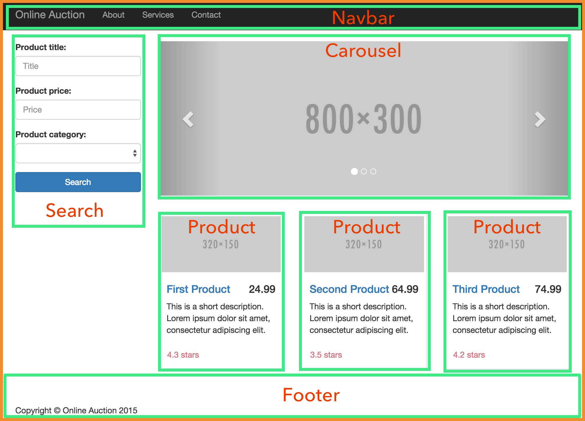
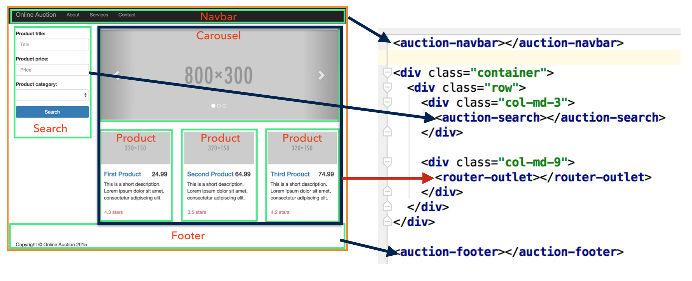

= A High Level Overview of Angular 2

AngularJS is by far the most popular JavaScript framework for creating Web applications. As per Brad Green, the engineering director at Google, 1.3M developers use AngularJS and 300K are already using the soon to be released Angular 2. After working with Angular 2 for the last 10 months I believe its effect on the JavaScript community will be similar to what Spring framework did for Java. In this article I'll give you a high-level overview of the Angular 2 framework.

In the end of 2014 Google announced that Angular 2 would be a complete re-write of AngularJS, and they even created a new language "AtScript" that was meant to be used for writing Angular 2. But then Microsoft agreed to add support for decorators (a.k.a. annotations) to TypeScript, and it became the language of choice for development of the Angular 2 framework tself, as well as the recommended language for developing applications with this framework. You can also develop Angular 2 apps in JavaScript (both ECMAScript 5 and 6) and in Dart.

The Angular team also borrowed another Microsoft product - RxJS - the library of reactive JavaScript extensions, and integrated it into Angular 2.

Angular 2 is not an MVC framework, but rather a component-based framework. An Angular 2 application is a tree of loosely coupled components. For example, the screenshot below shows the landing page for a sample online auction application that was initially prototyped as a collection of Navbar, Search, Carousel, Product, and Footer components.

[[FIG1-1]]
 

The image shows three Product components rendered, but the automatic rendering is done by binding the template to the array of components retrieved from the server. The title of each product has to work as a link navigating to the product details page. Since the auction should work as a single page application (SPA), we don't want to refresh the entire page to display product details. Let's reuse the area currently occupied by the carousel and products, so it can also render product details keeping the rest of the page unchanged. This is an easy task that can be accomplished in several steps:

1. Declare the area currently occupied by the carousel and products to be `<router-outlet>` so it can display different content depending on the user's navigation.

2. Encapsulate Carousel and Product inside the Home component

3. Create a new ProductDetail component

4. Configure the Angular's Router to show either Home or ProductDetail component in the designated `<router-outlet>` area.

But how what is a component? In TypeScript it's simply a class annotated with `@Component`:

[source, js]
----
@Component({
  selector: 'auction-home',
  template: `
    HTML or other markup goes here  
  `
})
export default class HomeComponent {
 
 // Application logic goes here
}
----

The annotation `@Component` is used for specifying the metadata for the component. For example, The value of the `selector` property identifies the name of the HTML tag that represents this component. The `template` property is the place for the HTML (or other) markup.

Coming back to the landing page of our auction, the template of the top level `ApplicationComponent` can look like this:

[[FIG1-2]]
 

This template consists of a mix of standard and custom HTML tags that represent respective components. If we'll store the markup in the file application.html, we'll use the property `templateURL` instead of `template`, and the code of the `ApplicationComponent` can look like this:

[source, js]
----
import {Component} from 'angular2/core';
import {Route, RouteConfig, RouterOutlet} from 'angular2/router';
import HomeComponent from '../home/home';
import NavbarComponent from '../navbar/navbar';
import FooterComponent from '../footer/footer';
import SearchComponent from '../search/search';
import ProductDetailComponent from "../product-detail/product-detail";

@Component({
  selector: 'auction-application',
  templateUrl: 'app/components/application/application.html',
  directives: [
    RouterOutlet,
    NavbarComponent,
    FooterComponent,
    SearchComponent,
    HomeComponent
  ]
})
@RouteConfig([
  {path: '/', component: HomeComponent, as: 'Home'},
  {path: '/products/:id', component: ProductDetailComponent, as: 'ProductDetail'}
])
export default class ApplicationComponent {}
----

The class `ApplicationComponent` is annotated with `@Component` and `@RouteConfig`. The value of the `selector` property will be used as an HTML tag `<auction-application>`. The `templateURL` specified the location of the markup. The section `directives` includes the `RouterOutlet` and  all child components. 

The annotation `@RouteConfig` configures two routes for the client-side navigation: 

* `Home` is represented by `HomeComponent` and mapped to the URL fragment `/`.
* `ProductDetail` is represented by `ProductDetailComponent` and mapped to the URL fragment `/product:id`.

When the user clicks on a particular product title, the content of the default `Home` route will be replaced with the content of the `ProductDetail` route, which will get the value of the parameter `id` and will display the product details in the `<router-outlet>` area.

== Dependency Injection

Components use services for implementing business logic. Services are just classes that Angular instantiates and injects into components. 

[source, js]
----
export class ProductService {

  products: Product[] = [];

  getProducts(): Array<Product> {
    // The code to retrieve product into goes here
  
    return products;
  }
}
----

If you'll specify the `ProductService` as a type of the argument's constructor in `HomeComponent`, Angular will instantiate and inject the service into the component:

[source, js]
----
@Component{
 ...
}
export default class HomeComponent {
  products: Product[] = [];

  constructor(productService: ProductService) {
    this.products = productService.getProducts();
  }
}
----

Angular's dependency injection module is pretty flexible, but not difficult to use because the objects can be injected only via constructors. Injectors form a hierarchy (each component has an injector), and the injectable object doesn't have to be an application-level singleton.

== Inter-component communications

The component communication can and should be implemented in a loosely coupled manner. A component can declare input and output properties. To pass the data from parent to child component, the parent binds the values to the input properties of the child. The child has no idea who provided the values, but knows what to do with them.

If a component needs to pass the data to the outside world, it emits the events via the output property. Emits to whom? It's none of the component's business. Whoever is interested will create a listener to the custom component's event.

Having this mechanism allows treating components as black boxes that can get the values in or send the data out. Recently I've recorded a https://yakovfain.com/2016/03/21/implementing-the-mediator-design-pattern-in-angular-2/[short video] illustrating one of the implementations of the Mediator design pattern in Angular 2. 

== Why TypeScript

TypeScript is a superset of JavaScript but it offers optional types. By declaring variables with types you're getting a great tooling support, which will make you more productive. TypeScript comes with a static code analyzer, and as you type in your IDE that supports TypeScript (WebStorm, Visual Studio Code, Sublime Text, et al.) you're getting context sensitive help suggesting you the methods available in the object or types of the function argument.  If you're using the wrong types, the IDE will highlight the erroneous code.
See how WebStorm supports TypeScript http://blog.jetbrains.com/webstorm/2016/04/angular-2-workflow-in-webstorm/[here].

Even if your TypeScript application uses a third-party library written in JavaScript, you can install a type definition file (having the extension .d.ts), which has type declarations for this library. Type declarations for hundreds of popular JavaScript libraries are available and you install them with one of the TypeScript Definition Managers: Typings or tsd. 

== Performance and Rendering

Rendering performance is substantially improved in Angular 2. On top of that the fact that the rendering module is located in a separate module you can run the computation-heavy code in a worker thread. Visit http://www.roblog.io/js-repaint-perfs/[the Repaint Rate Challenge Web site] to compare the rendering performance of various frameworks. Experience the speed of rendering of a large data grid with constantly updated data. Run the test titled "DBMON Angular 2.0 Beta - Web Workers". The grid is repainted blazingly fast. Note the frame rate - it's over 100 frames per second.

If you ask me what are the main features of Angular 2 that set them apart from other frameworks, I'll say "A separate module for template rendering and Zones".

* Having the component's UI declared in templates processed by an independent renderer opens lots of opportunities starting from optimization and precompilation of templates and ending with creating templates for rendering to different devices.

* The module zone.js monitors the changes in the application and makes decisions on when to update the UI of each component. Any async event triggers the revalidation of the UI in each component and it works amazingly fast.

NOTE: While for majority of the applications you don't need to know the internals of zone.js, if you'll ever work on the project that requires fine tuning UI rendering in the complex application, allocate an extra week just for learning how the Zone works. 

Keeping the rendering engine in a separate module allows to use not only the DOM renderer (default), but use the other ones as well. In particular, you reuse the same application code with the renderers for mobile devices that use native components. One of such examples is using http://angularjs.blogspot.com/2016/03/code-reuse-in-angular-2-native-mobile.html?view=classic[NativeScript framework] that serves as a bridge between JavaScript and native UI components of iOS and Android. With NativeScript you would reuse the same component's code replacing HTML in the template with XML.

== Tooling

While understanding the syntax and architecture of Angular 2 applications is a lot easier than of AngularJS 1.X, tooling is a bit more complex. This is not surprising: you write code in one language, but deploy in another. 

Currently the project https://github.com/angular/angular-cli[Angular CLI] is in the works, and it will substantially simplify various processes starting from initial project generation and ending with production deployment.

Debugging of your applications can be done either in the IDE or in the browser. We use Chrome Developer Tools for debugging. The generated source maps allow you to debug the TypeScript code while the browser runs JavaScript. If you prefer to debug JavaScript, it's also possible because the TypeScript transpiler generates JavaScript that can be read by humans. 

== Testing and Deployment

Angular 2 comes with testing library that allows you to write unit tests in the BDD format. Currently it supports only Jasmine framework, but other frameworks will be supported in the future as well. We use Karma test runner that allows running tests against various browsers.

The framework Protractor will allow you to write end-to-end tests for your applications.

Monitor the network while loading a simple application in development mode, and you'll see that the browser downloads more than 5Mb (half of it is the TypeScript compiler used by the module loader SystemJS). But after running deployment and optimization scripts (we use the Webpack bundler), the size of a small app can be as little as 160K (including the Angular 2 framework).

We're looking forward to see how Angular CLI will implement production bundling. The Angular team has an ambitious goal to lower the framework's overhead to 50Kb.

== Libraries of UI Components

At the time of this writing there are several libraries of the UI components that you can use with Angular 2 applications:

* http://www.primefaces.org/primeng/[PrimeNG] - a library of Angular 2 UI components  by the creators of PrimeFaces (a popular library used with JavaServer Faces framework).

* https://wijmo.com/angular2/[Wijmo 5] - a commercial library of Angular 2 UI components. You have to purchase a developer's license(s) to use it.

* https://www.polymer-project.org/1.0/[Polymer] - a library of nice looking extendable components by Google. In our company we've managed to create a pilot Angular 2 app that uses Polymer components, but the integration of the two was not flawless. 

* https://github.com/angular/material2[Material Design 2] - it's a library of UI components being created by Google specifically for Angular 2. Currently this library in its early Alpha, but this project is pretty active, and I expect to see a couple of dozen of well designed UI components in the upcoming 3-4 months.

== Is it safe to use Angular 2 in the real world?

Starting from the first Beta release we are using Angular 2 for the real world project and have not ran into any issue that didn't have a workaround. 

If you want to play safe, wait for another couple of months. The rumor has it that Angular 2 will be released at Google I/O conference in May of 2016.

== What's in the future

In March of 2016 Brad Green delivered a keynote presentation at the Fluent conference by O'Reilly. Watch https://www.oreilly.com/ideas/angular-2-and-the-future-of-html5-apps[the video] of this presentation. Are you impressed? I am. 